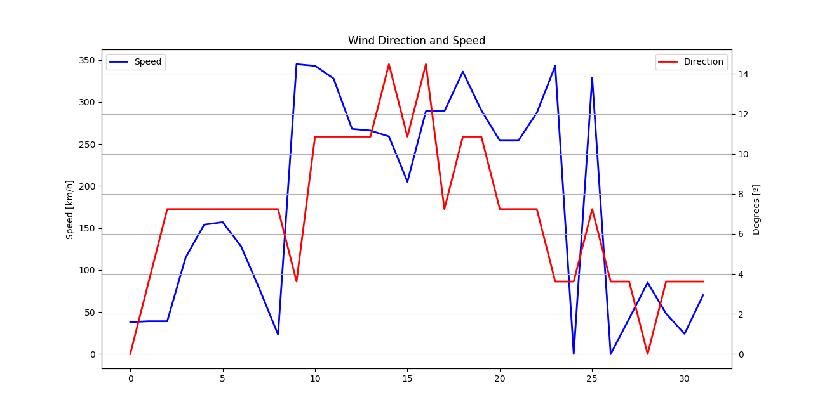

# Captor Project

## Anemometer and wind vane wiring

Captor Project's objective is to establish low cost sensor network to control air pollution.

This GitHub repository saves the code to add an anemometer and a wind vane to the gadget.

* [Captor Project](https://www.captor-project.eu/es/)

Data acquisition is done through an Arduino YUN and then is graphical represented using Pyhton's Matplotlib library.

One of the first results during indoor experiments can see below:

